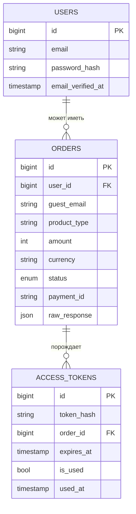

# ARCHITECTURE.md — MicroCrop

**Документ:** Техническая архитектура
**Основан на:** [SPECIFICATION.md](SPECIFICATION.md)
**Версия:** 1.0
**Дата:** 2026-09-18

**Стек:**
- Backend: Laravel 10/11 (PHP 8.2+)
- Database: MySQL 8.0 (`127.0.0.1:3306`, DB `microcrop`, user `mysql` / pass `mysql`)
- Frontend: React 18 (Vite SPA + Blade SEO-обёртка, prerender), Node.js 18
- Processing Engine: `@ffmpeg/ffmpeg` (FFmpeg.wasm v0.12+)
- Payments: Robokassa API (самозанятый/НПД)
- Monetization: РСЯ (Yandex Advertising Network)

---

## 1. System Architecture Diagram

Ключевой принцип: **видеофайл никогда не пересекает границу браузера**. Laravel-backend участвует только в SEO-рендеринге страниц-обёрток и в цепочке платежей/токенов. FFmpeg.wasm работает целиком в браузере (в Web Worker).

```mermaid
flowchart TB
    subgraph Client["Браузер пользователя"]
        direction TB
        User["Пользователь"]
        ReactApp["React 18 SPA\n(Crop Box / Timeline / Player)"]
        FFmpegWorker["FFmpeg.wasm\n(Web Worker, WASM)"]
        LocalFile["Видеофайл\n(в памяти браузера, Blob)"]
        YaAd["YandexAdBlock.jsx\n(РСЯ виджеты)"]
        LS["localStorage\n(PRO access token)"]

        User -->|drag&drop / выбор файла| ReactApp
        ReactApp -->|Blob, без сети| LocalFile
        ReactApp -->|команды рендера| FFmpegWorker
        FFmpegWorker -->|crop/trim/watermark| LocalFile
        LocalFile -->|MP4 результат| ReactApp
        ReactApp --> YaAd
        ReactApp <--> LS
    end

    subgraph LaravelBackend["Laravel Backend (PHP 8.2+)"]
        direction TB
        BladeSSR["Blade SEO-страницы\n(SSR, meta/OG, sitemap.xml, robots.txt)"]
        PaymentsAPI["Payments API\n/api/payments/*"]
        TokensAPI["Tokens API\n/api/tokens/*"]
        WebhookHandler["Robokassa Callback Handler\n(валидация подписи)"]
    end

    subgraph MySQL["MySQL 8.0 (microcrop)"]
        OrdersTbl[("orders")]
        TokensTbl[("access_tokens")]
        UsersTbl[("users")]
    end

    subgraph Robokassa["Robokassa API"]
        RoboPay["Payment Page"]
        RoboCallback["ResultURL Callback"]
    end

    subgraph YandexRTB["РСЯ (Yandex.RTB)"]
        AdServer["Ad Server"]
    end

    ReactApp -->|1. GET страница| BladeSSR
    ReactApp -->|2. POST /api/payments/create| PaymentsAPI
    PaymentsAPI -->|создать order| OrdersTbl
    PaymentsAPI -->|3. redirect URL| RoboPay
    RoboPay -->|4. пользователь платит| User
    RoboCallback -->|5. ResultURL POST| WebhookHandler
    WebhookHandler -->|проверка подписи MD5/SHA256| WebhookHandler
    WebhookHandler -->|обновить статус| OrdersTbl
    WebhookHandler -->|создать токен| TokensTbl
    ReactApp -->|6. POST /api/tokens/validate| TokensAPI
    TokensAPI -->|проверить| TokensTbl
    TokensAPI -->|валиден?| ReactApp
    ReactApp -.->|token в LS| LS

    YaAd -->|async script + yaContextCb| AdServer
    AdServer -->|баннер| YaAd

    style Client fill:#eef7ff,stroke:#3b82f6
    style LaravelBackend fill:#fff7ed,stroke:#f97316
    style MySQL fill:#f0fdf4,stroke:#22c55e
    style Robokassa fill:#fef2f2,stroke:#ef4444
    style YandexRTB fill:#faf5ff,stroke:#a855f7
```



### 1.1 Пояснение потоков данных

1. Пользователь открывает SEO-страницу (Blade SSR отдаёт готовый HTML с мета-тегами) → внутри неё монтируется React SPA (редактор).
2. Видео загружается **только в память браузера** (`File`/`Blob`), сеть не используется.
3. Crop/Trim/Watermark выполняются `@ffmpeg/ffmpeg` в Web Worker — UI-поток не блокируется.
4. Если пользователь хочет снять водяной знак — фронтенд обращается к Laravel API (`/api/payments/create`), получает ссылку на Robokassa, пользователь оплачивает.
5. Robokassa шлёт server-to-server callback (`ResultURL`) на `/api/payments/callback` — Laravel валидирует подпись, помечает `orders.status = paid`, генерирует `access_tokens`.
6. Фронтенд поллингом/по возврату с оплаты запрашивает `/api/tokens/validate` (либо получает токен напрямую после редиректа), сохраняет JWT в `localStorage`, и при следующем рендере FFmpeg.wasm запускается **без** фильтра `drawtext` водяного знака.
7. Рекламные блоки РСЯ грузятся асинхронно и независимо от основного потока редактирования.

---

## 2. SEO Strategy & Landing Pages Architecture

### 2.1 Структура маршрутов

Каждая посадочная страница — отдельный Laravel-роут (Blade SSR-обёртка) с уникальным SEO-контентом, монтирующий один и тот же React-редактор с разными **предустановками** (`preset`), передаваемыми через `data-*` атрибуты/inline JSON в HTML.

```
routes/web.php
├─ GET /                         → HomeController@index          (preset: free/no default crop)
├─ GET /crop-video-online        → LandingController@show('crop-video-online')
├─ GET /crop-for-reels           → LandingController@show('crop-for-reels')     (preset: 9:16)
├─ GET /crop-for-shorts          → LandingController@show('crop-for-shorts')    (preset: 9:16)
├─ GET /crop-for-tiktok          → LandingController@show('crop-for-tiktok')    (preset: 9:16)
├─ GET /crop-for-vk-clips        → LandingController@show('crop-for-vk-clips')  (preset: 9:16)
├─ GET /trim-video               → LandingController@show('trim-video')        (preset: trim-only)
├─ GET /circle-video-telegram    → LandingController@show('circle-video-telegram') (preset: 1:1 + mask)
├─ GET /crop-square-1-1          → LandingController@show('crop-square-1-1')   (preset: 1:1)
├─ GET /sitemap.xml              → SitemapController@index
└─ GET /robots.txt               → RobotsController@index
```

### 2.2 Модель данных лендингов

Список посадочных страниц хранится не хардкодом в роутах, а в конфиге/БД-таблице `landing_pages` — чтобы sitemap и сама страница генерировались из одного источника:

```php
// config/landings.php
return [
    'crop-video-online' => [
        'title' => 'Обрезать видео онлайн бесплатно — MicroCrop',
        'description' => 'Обрежьте и кадрируйте видео прямо в браузере без загрузки на сервер...',
        'h1' => 'Обрезать видео онлайн',
        'preset' => null,
        'og_image' => '/images/og/crop-video-online.jpg',
        'faq' => [ /* ... */ ],
    ],
    'crop-for-reels' => [
        'title' => 'Кадрировать видео для Reels/Shorts — 9:16 онлайн',
        'description' => 'Превратите горизонтальное видео в вертикальный формат 9:16 для Reels, Shorts, TikTok...',
        'h1' => 'Сделать видео вертикальным для Reels',
        'preset' => ['ratio' => '9:16', 'label' => 'Reels/Shorts/TikTok'],
        'og_image' => '/images/og/crop-for-reels.jpg',
        'faq' => [ /* ... */ ],
    ],
    // ...
];
```

### 2.3 Динамические мета-теги и Open Graph

`LandingController` подставляет данные в Blade-layout:

```blade
{{-- resources/views/layouts/seo.blade.php --}}
<head>
    <title>{{ $meta['title'] }}</title>
    <meta name="description" content="{{ $meta['description'] }}">
    <link rel="canonical" href="{{ url()->current() }}">

    <meta property="og:type" content="website">
    <meta property="og:title" content="{{ $meta['title'] }}">
    <meta property="og:description" content="{{ $meta['description'] }}">
    <meta property="og:image" content="{{ asset($meta['og_image']) }}">
    <meta property="og:url" content="{{ url()->current() }}">

    <meta name="twitter:card" content="summary_large_image">

    <script type="application/ld+json">
    {!! json_encode([
        '@context' => 'https://schema.org',
        '@type' => 'SoftwareApplication',
        'name' => 'MicroCrop',
        'applicationCategory' => 'MultimediaApplication',
        'operatingSystem' => 'Web',
        'offers' => ['@type' => 'Offer', 'price' => '0', 'priceCurrency' => 'RUB'],
    ]) !!}
    </script>
</head>
<body>
    <h1>{{ $meta['h1'] }}</h1>
    {{-- Текстовый SEO-контент, FAQ и т.д. индексируется как обычный HTML --}}
    @yield('content')

    {{-- React SPA монтируется сюда, получает preset через data-атрибут --}}
    <div id="microcrop-app" data-preset='@json($meta['preset'])'></div>
    @vite('resources/js/app.jsx')
</body>
```

### 2.4 Prerender / гидрация React

- Blade отдаёт **полностью читаемый HTML** (текст лендинга, FAQ, H1-H3) без ожидания JS — это индексируемый контент;
- React SPA гидрируется в `#microcrop-app` поверх этого HTML (сам редактор — client-only, т.к. зависит от `FileReader`/WASM/Worker API, недоступных при SSR);
- Опционально (v1.1): статический prerender React-виджета (например, скринридер-friendly skeleton) через `vite-plugin-prerender` для ускорения LCP — не критично, т.к. текстовый SEO-контент уже в Blade.

### 2.5 `sitemap.xml`

```php
// app/Http/Controllers/SitemapController.php
class SitemapController extends Controller
{
    public function index()
    {
        $urls = collect(config('landings'))
            ->keys()
            ->map(fn ($slug) => [
                'loc' => url('/' . $slug),
                'lastmod' => now()->toDateString(),
                'changefreq' => 'weekly',
                'priority' => $slug === '' ? '1.0' : '0.8',
            ])
            ->prepend(['loc' => url('/'), 'lastmod' => now()->toDateString(), 'changefreq' => 'daily', 'priority' => '1.0']);

        return response()
            ->view('sitemap', compact('urls'))
            ->header('Content-Type', 'text/xml');
    }
}
```

### 2.6 `robots.txt`

```php
// routes/web.php
Route::get('/robots.txt', function () {
    return response(
        "User-agent: *\n" .
        "Disallow: /api/\n" .
        "Disallow: /admin/\n" .
        "Sitemap: " . url('/sitemap.xml') . "\n",
        200
    )->header('Content-Type', 'text/plain');
});
```

---

## 3. Database Schema (MySQL Migrations)

Подключение (см. [SPECIFICATION.md §4.3](SPECIFICATION.md)): `127.0.0.1:3306`, DB `microcrop`, user/pass `mysql`/`mysql`.

### 3.1 `users` (опционально, для будущего личного кабинета; в MVP используется guest-flow по email)

```php
// database/migrations/2026_09_18_000001_create_users_table.php
Schema::create('users', function (Blueprint $table) {
    $table->id();
    $table->string('email')->unique();
    $table->string('password_hash')->nullable(); // nullable: guest-заказы без пароля
    $table->timestamp('email_verified_at')->nullable();
    $table->timestamps();
});
```

### 3.2 `orders`

```php
// database/migrations/2026_09_18_000002_create_orders_table.php
Schema::create('orders', function (Blueprint $table) {
    $table->id();
    $table->foreignId('user_id')->nullable()->constrained('users')->nullOnDelete();
    $table->string('guest_email')->nullable(); // для оплаты без регистрации
    $table->string('product_type')->default('remove_watermark'); // remove_watermark | fast_render | social_presets
    $table->unsignedInteger('amount'); // в копейках, во избежание float-ошибок
    $table->string('currency', 3)->default('RUB');
    $table->enum('status', ['pending', 'paid', 'failed', 'refunded'])->default('pending');
    $table->string('payment_id')->nullable()->index(); // Robokassa InvId
    $table->json('raw_response')->nullable(); // сырой payload callback'а для аудита/отладки
    $table->timestamps();

    $table->index(['status', 'created_at']);
});
```

### 3.3 `access_tokens`

```php
// database/migrations/2026_09_18_000003_create_access_tokens_table.php
Schema::create('access_tokens', function (Blueprint $table) {
    $table->id();
    $table->string('token_hash')->unique(); // хранится только хэш (sha256) выданного JWT/токена
    $table->foreignId('order_id')->constrained('orders')->cascadeOnDelete();
    $table->timestamp('expires_at');
    $table->boolean('is_used')->default(false); // для одноразовых PRO-токенов (single-use export)
    $table->timestamp('used_at')->nullable();
    $table->timestamps();

    $table->index(['token_hash', 'expires_at']);
});
```

### 3.4 `landing_pages` (опционально, если решено вынести из конфига в БД — v1.1)

```php
Schema::create('landing_pages', function (Blueprint $table) {
    $table->id();
    $table->string('slug')->unique();
    $table->string('title');
    $table->text('description');
    $table->string('h1');
    $table->json('preset')->nullable();
    $table->string('og_image')->nullable();
    $table->json('faq')->nullable();
    $table->boolean('is_active')->default(true);
    $table->timestamps();
});
```

### 3.5 ER-диаграмма



---

## 4. Watermark & FFmpeg Filter Specification

### 4.1 Общий пайплайн клиентского рендера

```
Исходный файл (Blob)
   → ffmpeg.wasm FS.writeFile("input.mp4", ...)
   → ffmpeg -i input.mp4 -ss {start} -to {end} -vf "crop=...[,drawtext=...]" -c:v libx264 -preset {fast|veryfast} output.mp4
   → FS.readFile("output.mp4") → Blob → URL.createObjectURL → download
```

### 4.2 Фильтр кадрирования (Crop)

```
crop={crop_w}:{crop_h}:{crop_x}:{crop_y}
```
Значения `crop_w/h/x/y` вычисляются на фронтенде из координат Crop Box (в пикселях исходного видео, с учётом масштаба превью → реального разрешения).

### 4.3 Фильтр водяного знака (Watermark) — бесплатный тариф

```bash
ffmpeg -i input.mp4 \
  -vf "crop=608:1080:236:0,drawtext=text='microcrop':fontcolor=white@0.5:fontsize=24:x=w-tw-20:y=h-th-20:box=1:boxcolor=black@0.2:boxborderw=5" \
  -c:v libx264 -preset veryfast -crf 23 \
  -c:a aac -b:a 128k \
  output.mp4
```

**Разбор параметров `drawtext`:**

| Параметр | Значение | Назначение |
|---|---|---|
| `text='microcrop'` | статический текст | Бренд-водяной знак |
| `fontcolor=white@0.5` | белый, альфа 0.5 | Полупрозрачность 50% |
| `fontsize=24` | 24px | Размер шрифта (адаптируется под разрешение — см. 4.4) |
| `x=w-tw-20` | ширина кадра − ширина текста − 20px | Отступ 20px от правого края |
| `y=h-th-20` | высота кадра − высота текста − 20px | Отступ 20px от нижнего края |
| `box=1:boxcolor=black@0.2:boxborderw=5` | полупрозрачная плашка под текстом | Читаемость на светлом фоне (опционально) |

**Важно:** в MP4/WebAssembly-сборке ffmpeg.wasm по умолчанию нет встроенного шрифта — необходимо явно подключить `.ttf` через `fontfile=`:

```bash
drawtext=fontfile=/fonts/Inter-Regular.ttf:text='microcrop':fontcolor=white@0.5:fontsize=24:x=w-tw-20:y=h-th-20
```

Файл шрифта загружается в virtual FS ffmpeg.wasm перед рендером:
```js
await ffmpeg.writeFile('/fonts/Inter-Regular.ttf', await fetchFile('/assets/fonts/Inter-Regular.ttf'));
```

### 4.4 Адаптивность размера водяного знака

`fontsize` и отступы (`20px`) должны масштабироваться относительно разрешения выходного видео, иначе на 4K-видео знак будет визуально «неощутим», а на 480p — займёт четверть кадра:

```
fontsize = round(output_height * 0.03)   // ~3% от высоты кадра
margin   = round(output_height * 0.02)   // ~2% отступ
```
Формула вычисляется на JS-стороне и подставляется в шаблон FFmpeg-команды динамически.

### 4.5 Логика включения/выключения фильтра

```js
// resources/js/lib/ffmpegPipeline.js
function buildFilterChain({ crop, hasProAccess, outputHeight }) {
  const filters = [];

  if (crop) {
    filters.push(`crop=${crop.w}:${crop.h}:${crop.x}:${crop.y}`);
  }

  if (!hasProAccess) {
    const fontsize = Math.round(outputHeight * 0.03);
    const margin = Math.round(outputHeight * 0.02);
    filters.push(
      `drawtext=fontfile=/fonts/Inter-Regular.ttf:text='microcrop':` +
      `fontcolor=white@0.5:fontsize=${fontsize}:` +
      `x=w-tw-${margin}:y=h-th-${margin}`
    );
  }

  return filters.join(',');
}
```

`hasProAccess` определяется на фронтенде результатом `/api/tokens/validate` (см. §6.3), закешированным в памяти React-стейта на время сессии рендера — **не** доверяем клиентскому флагу без сервер-подтверждения токена, но сама проверка — легковесная, вызывается перед стартом каждого рендера.

### 4.6 Триминг (Trim/Cut)

```bash
ffmpeg -ss {start_time} -to {end_time} -i input.mp4 -vf "{filters}" -c:v libx264 -preset veryfast output.mp4
```
Порядок `-ss` **до** `-i` использует быстрый seek (менее точный, но быстрее — приемлемо для клиентской обработки; для точного кадра можно переместить `-ss` после `-i`, но это медленнее на WASM).

---

## 5. Ad Placement Architecture (РСЯ)

### 5.1 Компонент `YandexAdBlock.jsx`

```jsx
// resources/js/components/ads/YandexAdBlock.jsx
import { useEffect, useRef, useState } from 'react';

const AD_BLOCK_IDS = {
  header: 'R-A-XXXXXX-1',
  sidebar: 'R-A-XXXXXX-2',
  renderScreen: 'R-A-XXXXXX-3',
};

export default function YandexAdBlock({ placement, className = '' }) {
  const containerRef = useRef(null);
  const [failed, setFailed] = useState(false);
  const blockId = AD_BLOCK_IDS[placement];

  useEffect(() => {
    if (!blockId || !containerRef.current) return;

    let cancelled = false;
    const containerId = `yandex_rtb_${placement}_${Math.random().toString(36).slice(2)}`;
    containerRef.current.id = containerId;

    // Таймаут-стража: если РСЯ-скрипт не инициализировал блок за 3с — считаем блокировку рекламы
    const failTimer = setTimeout(() => {
      if (!cancelled) setFailed(true);
    }, 3000);

    window.yaContextCb = window.yaContextCb || [];
    window.yaContextCb.push(() => {
      if (cancelled) return;
      clearTimeout(failTimer);
      try {
        window.Ya.Context.AdvManager.render({
          blockId,
          renderTo: containerId,
          async: true,
        });
      } catch (e) {
        setFailed(true);
      }
    });

    return () => {
      cancelled = true;
      clearTimeout(failTimer);
    };
  }, [placement, blockId]);

  if (failed) {
    // AdBlock fallback: не оставляем пустую дыру в layout, но и не мешаем интерфейсу
    return <div className={`ad-fallback ${className}`} aria-hidden="true" />;
  }

  return <div ref={containerRef} className={`ad-slot ad-slot--${placement} ${className}`} />;
}
```

### 5.2 Подключение скрипта РСЯ (один раз, глобально)

```jsx
// resources/js/app.jsx (точка входа)
useEffect(() => {
  if (document.getElementById('yandex-rtb-script')) return;
  const script = document.createElement('script');
  script.id = 'yandex-rtb-script';
  script.src = 'https://an.yandex.ru/system/context.js';
  script.async = true;
  script.onerror = () => console.warn('Yandex RTB script failed to load (adblock?)');
  document.head.appendChild(script);
}, []);
```

### 5.3 Точки размещения

| Placement | Компонент/расположение | Условие показа |
|---|---|---|
| `header` | `<YandexAdBlock placement="header" />` в шапке layout | Все бесплатные пользователи (десктоп + адаптивная версия на мобильном) |
| `sidebar` | Боковая панель редактора (только desktop-раскладка, `≥1024px`) | Скрывается на мобильных через CSS/условный рендер |
| `renderScreen` | Экран ожидания рендера FFmpeg.wasm (`<RenderingScreen>`) | Показывается только во время активного прогресса рендера — использует «мёртвое» время ожидания |

### 5.4 Защита от сбоя UI (AdBlock fallback)

- Компонент **никогда** не должен ронять остальное приложение — вся инициализация обёрнута в `try/catch`, ошибки скрипта РСЯ логируются, но не пробрасываются;
- Таймаут-стража (3 сек) переводит блок в `failed`-состояние → рендерится `.ad-fallback` — пустой div нулевой/минимальной высоты, чтобы не оставлять «дыру» в layout (CSS: `min-height` через `aspect-ratio`, а не жёсткий `height`, чтобы при неудаче не оставалось лишнего пустого пространства);
- Никакая бизнес-логика (доступ к экспорту, водяной знак, оплата) **не зависит** от того, загрузилась ли реклама — блокировщик рекламы не должен ломать основной функционал.

---

## 6. API Endpoints Specification (Laravel)

Базовый префикс: `/api`. Формат: JSON. Аутентификация не требуется для guest-флоу (заказ идентифицируется по `order_id`/email), опционально Sanctum-токен для зарегистрированных пользователей (v1.1).

### 6.1 `POST /api/payments/create`

Создаёт заказ и возвращает ссылку на оплату Robokassa.

**Request:**
```json
{
  "product_type": "remove_watermark",
  "guest_email": "user@example.com"
}
```

**Обработка (контроллер):**
```php
// app/Http/Controllers/Api/PaymentsController.php
public function create(CreateOrderRequest $request)
{
    $amount = config('robokassa.prices')[$request->product_type]; // в копейках

    $order = Order::create([
        'guest_email' => $request->guest_email,
        'product_type' => $request->product_type,
        'amount' => $amount,
        'currency' => 'RUB',
        'status' => 'pending',
    ]);

    $paymentUrl = $this->robokassa->buildPaymentUrl(
        invId: $order->id,
        outSum: $amount / 100,
        description: "MicroCrop: " . $request->product_type,
        email: $request->guest_email,
    );

    return response()->json([
        'order_id' => $order->id,
        'payment_url' => $paymentUrl,
    ]);
}
```

**Формирование подписи Robokassa (MD5):**
```php
// app/Services/RobokassaService.php
public function buildPaymentUrl(int $invId, float $outSum, string $description, ?string $email = null): string
{
    $merchantLogin = config('robokassa.merchant_login');
    $password1 = config('robokassa.password1');
    $outSumFormatted = number_format($outSum, 2, '.', '');

    $signature = md5("{$merchantLogin}:{$outSumFormatted}:{$invId}:{$password1}");

    return config('robokassa.base_url') . '?' . http_build_query([
        'MerchantLogin' => $merchantLogin,
        'OutSum' => $outSumFormatted,
        'InvId' => $invId,
        'Description' => $description,
        'SignatureValue' => $signature,
        'Email' => $email,
        'IsTest' => config('robokassa.is_test') ? 1 : 0,
        'Culture' => 'ru',
    ]);
}
```

**Response `200`:**
```json
{
  "order_id": 1042,
  "payment_url": "https://auth.robokassa.ru/Merchant/Index.aspx?MerchantLogin=...&SignatureValue=..."
}
```

### 6.2 `POST /api/payments/callback`

Принимает `ResultURL` от Robokassa (server-to-server, вызывается сервером Robokassa, а не браузером пользователя).

**Request (form-data от Robokassa):**
```
OutSum=299.00
InvId=1042
SignatureValue=8f3a9c...
```

**Обработка:**
```php
// app/Http/Controllers/Api/PaymentsController.php
public function callback(Request $request)
{
    $outSum = $request->input('OutSum');
    $invId = $request->input('InvId');
    $signature = $request->input('SignatureValue');

    $password2 = config('robokassa.password2');
    $expectedSignature = md5("{$outSum}:{$invId}:{$password2}");

    if (!hash_equals(strtolower($expectedSignature), strtolower($signature))) {
        Log::warning('Robokassa callback: invalid signature', $request->all());
        return response("bad sign", 400);
    }

    $order = Order::findOrFail($invId);
    $order->update([
        'status' => 'paid',
        'payment_id' => $invId,
        'raw_response' => $request->all(),
    ]);

    $rawToken = Str::random(64);
    AccessToken::create([
        'token_hash' => hash('sha256', $rawToken),
        'order_id' => $order->id,
        'expires_at' => now()->addHours(48),
        'is_used' => false,
    ]);

    // Токен также можно передать пользователю через email/redirect-параметр,
    // либо фронтенд получает его через polling /api/payments/{order_id}/status

    return response("OK{$invId}"); // формат ответа, ожидаемый Robokassa
}
```

**Response:** `200 OK{InvId}` (согласно протоколу Robokassa — иначе Robokassa будет повторять callback).

### 6.3 `POST /api/tokens/validate`

Проверка токена перед отключением водяного знака (вызывается фронтендом перед каждым PRO-рендером).

**Request:**
```json
{
  "token": "a1b2c3...raw-token-from-localstorage"
}
```

**Обработка:**
```php
// app/Http/Controllers/Api/TokensController.php
public function validate(Request $request)
{
    $tokenHash = hash('sha256', $request->input('token', ''));

    $accessToken = AccessToken::where('token_hash', $tokenHash)
        ->where('expires_at', '>', now())
        ->first();

    if (!$accessToken) {
        return response()->json(['valid' => false], 200);
    }

    return response()->json([
        'valid' => true,
        'expires_at' => $accessToken->expires_at->toIso8601String(),
        'product_type' => $accessToken->order->product_type,
    ]);
}
```

**Response `200`:**
```json
{
  "valid": true,
  "expires_at": "2026-09-20T12:00:00+00:00",
  "product_type": "remove_watermark"
}
```

### 6.4 Дополнительный эндпоинт: `GET /api/payments/{order}/status`

Для polling статуса оплаты со страницы редактора (пока пользователь ждёт возврата с Robokassa):

```php
public function status(Order $order)
{
    return response()->json([
        'status' => $order->status,
        'token' => $order->status === 'paid'
            ? optional($order->accessToken)->plainTextToken // отдаётся один раз при первом запросе после оплаты
            : null,
    ]);
}
```

> **Примечание по безопасности:** raw-токен нельзя хранить в БД в открытом виде (хранится только `token_hash`). Поэтому raw-значение должно быть передано фронтенду **один раз** — либо сразу в теле ответа `callback`/`status` сразу после генерации, либо через redirect `SuccessURL` от Robokassa с параметром в query (с последующей немедленной заменой URL через `history.replaceState`, чтобы токен не оставался в истории браузера/логах).

### 6.5 Middleware и защита эндпоинтов

- `POST /api/payments/callback` — исключён из CSRF-проверки (`VerifyCsrfToken::$except`), так как вызывается сервером Robokassa, не браузером; защищён исключительно проверкой подписи;
- Rate-limiting (`throttle:60,1`) на `POST /api/payments/create` и `POST /api/tokens/validate` — защита от абьюза/брутфорса токенов;
- Все ответы — `application/json`, ошибки в едином формате `{ "error": "message" }` с соответствующим HTTP-статусом.

---

## 7. Итоговая сводка ключевых архитектурных решений

| Решение | Обоснование |
|---|---|
| Видео не покидает браузер | Privacy-first, нулевые затраты на storage/transcoding-инфраструктуру |
| FFmpeg.wasm в Web Worker | Не блокирует UI-поток во время рендера |
| Blade SSR + React SPA-гидрация | Индексируемый SEO-контент + богатый интерактивный редактор |
| Хранение только `token_hash` в БД | Компрометация БД не даёт доступа к активным PRO-токенам |
| `raw_response` как JSON в `orders` | Аудит и дебаг платежей без отдельной таблицы логов |
| AdBlock-safe компонент РСЯ | Реклама — доп. доход, а не точка отказа основного функционала |

---

*Документ синхронизирован с [SPECIFICATION.md](SPECIFICATION.md) и подлежит обновлению по мере уточнения деталей интеграции с Robokassa (тестовый/боевой режим) и структуры v1.1/v2 функциональности.*
